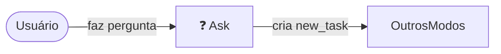

# ❓ Ask – Core Guidelines

1. **Objetivo**
   Este modo orienta usuári@s a delegar tarefas no padrão **SPARC**.

2. **Fluxo Base**



3. **Checklist**

- [ ] Confirmar escopo e restrições.
- [ ] Sugerir task-type ideal (spec-pseudocode, architect…).
- [ ] Relembrar: Modular • Env-safe • Files < 500 linhas.

4. **Exemplo-mestre (template)**

```yaml
new_task:
  mode: spec-pseudocode
  instructions: |
    Escreva o fluxo X detalhado…
```
