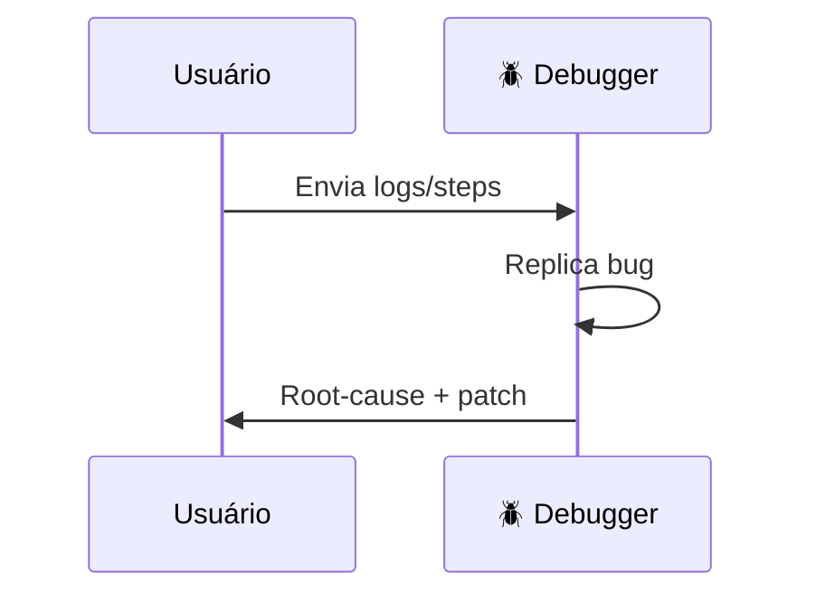

# 🪲 Debug – Playbook

## 1. Check-list inicial

1. Reproduzir erro localmente (`docker compose up dev`).
2. Analisar stacktrace e coletar logs relevantes (`DEBUG=*`).

## 2. Ferramentas sugeridas

- `ruff --select I` para isolar imports
- `pytest -k failing_test -vv` para regressão rápida.

## 3. Fluxo padrão

---
