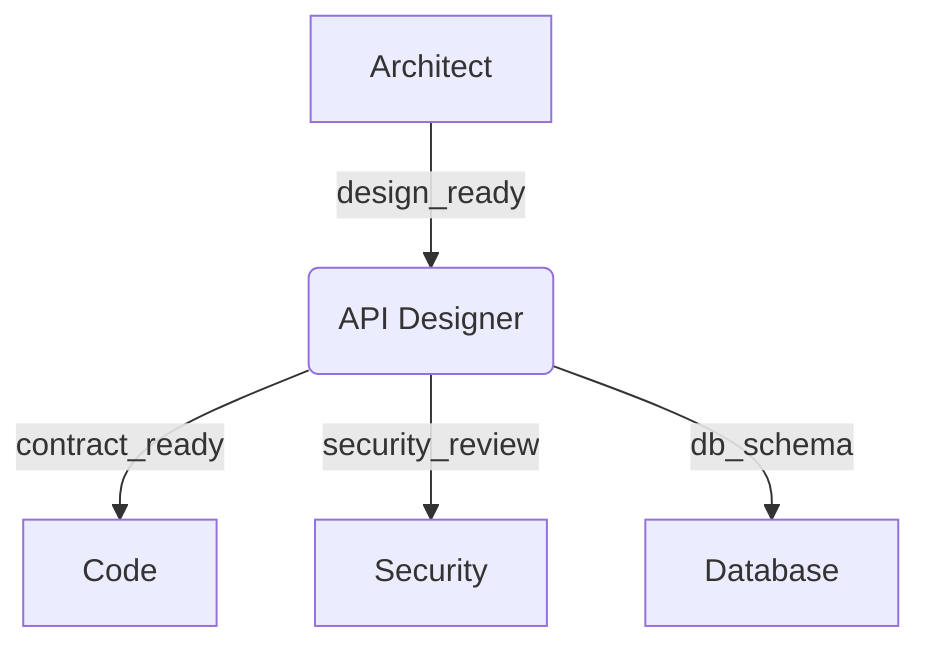

# Exemplo: Modo API Designer

```yaml
---
title: API Design Specialist
description: Modo para design de contratos de API
slug: api-design-specialist
version: 2.1.0
requires:
  - architect
  - security-review
  - database-specialist
---
```

## Fluxo de Trabalho



## Handoffs Chave

### Entrada
```yaml
handoff_from:
  - architect: design_ready
  - code: breaking_change_detected
```

### Saída
```yaml
handoff_to:
  - code: implement_contract
  - test: create_contract_tests
  - docs-writer: document_api
```

## Artefatos

1. **Contrato OpenAPI**:
   ```yaml
   paths:
     /users:
       get:
         responses:
           200:
             description: Lista de usuários
   ```

2. **Testes de Contrato**:
   - Validação de schemas
   - Exemplos de payload

3. **Decisões de Versionamento**:
   - Estratégia (URI vs Header)
   - Política de depreciação

## Exemplo Completo

```python
def generate_openapi():
    """Gera contrato a partir do design"""
    return {
        "openapi": "3.1.0",
        "info": {"title": "User API"},
        "paths": {...}
    }
```

## Related Links
- [Simple Logger Example](./simple-logger.md)
- [Guidelines](../guidelines.md)
