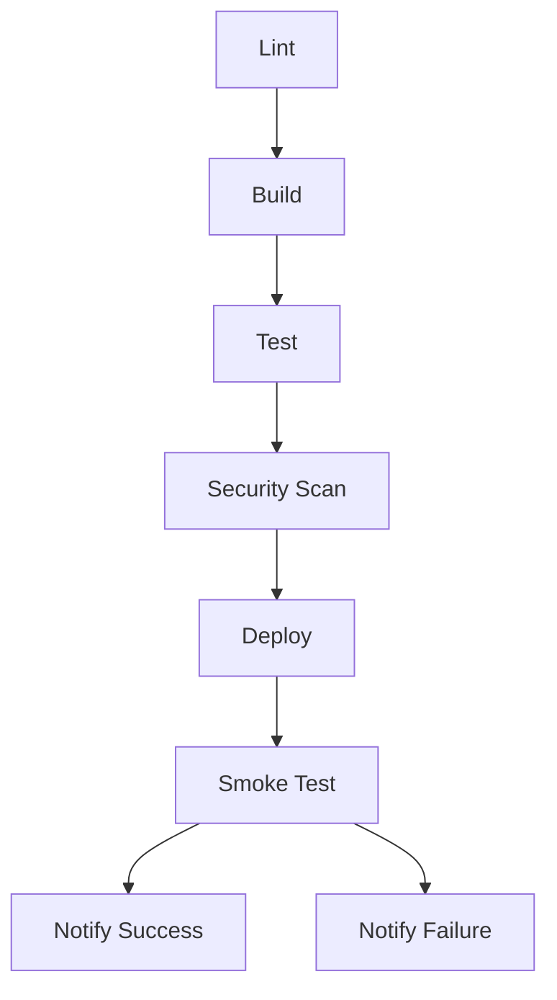

# Memory Bank System

## CI/CD Pipeline Secrets Requirements

Para configurar o pipeline de deploy, os seguintes secrets devem ser configurados no GitHub:

1. AWS Credentials:
   - `AWS_ACCESS_KEY_ID`
   - `AWS_SECRET_ACCESS_KEY`
   - `AWS_REGION`

2. Kubernetes/Production:
   - `PRODUCTION_URL` - URL base do ambiente de produção
   - `KUBE_CONFIG` - Configuração do cluster Kubernetes (opcional, pode usar IAM)

3. Observability:
   - `SLACK_WEBHOOK` - Para notificações

## Deployment Strategy

O pipeline implementa:
- Blue-green deployment usando Helm
- Rollback automático em caso de falha nos smoke tests
- Aprovação manual para produção (via GitHub Environments)
- Verificação de saúde pós-deploy

## Propósito

Sistema de armazenamento de contexto para decisões técnicas e padrões arquiteturais.
Facilita a manutenção de conhecimento compartilhado e histórico de decisões.

## Arquivos do Projeto

### activeContext.md

- Armazena o contexto atual do sistema
- Inclui informações sobre o estado do projeto
- Atualizado automaticamente pelo sistema

### decisionLog.md

- Registro estruturado de decisões técnicas
- Segue formato ADR (Architectural Decision Record)
- Inclui contexto, alternativas e consequências

### productContext.md

- Documenta o contexto do produto
- Requisitos não-funcionais e métricas
- Stakeholders e objetivos de negócio

### progress.md

- Histórico de progresso e marcos
- Atualizações de status do projeto
- Links para PRs e deploys relevantes

### systemPatterns.md

- Padrões arquiteturais adotados
- Diagramas C4 e fluxos do sistema
- Convenções de código e boas práticas

## Guia de Atualização

1. Para adicionar nova decisão:

   ```bash
   cp memory-bank/decisionLog.md memory-bank/ADR-XXX.md
   ```

2. Preencher o template ADR com:
   - Contexto
   - Decisão
   - Consequências
3. Atualizar `decisionLog.md` com link para o novo ADR

## Exemplos de Uso

### Criando nova decisão técnica

```markdown
# ADR-001: Escolha do Framework Frontend

## Contexto
Necessidade de padronizar o framework para interfaces...

## Decisão
Adotar Next.js 14 com React 18 devido a...

## Consequências
- Vantagem: SSR nativo
- Desvantagem: Curva de aprendizado
```

### Atualizando contexto

```markdown
## Estado Atual [2025-06-27]
- Versão 1.2.0 em produção
- Próximo milestone: Integração com API de pagamento
```

## Pipeline CI/CD



### Etapas do Pipeline

1. **Lint**: Verificação de formatação e estilo
2. **Build**: Compilação do pacote Python
3. **Test**: Testes unitários com pytest
4. **Security Scan**:
   - Detecção de secrets (Gitleaks)
   - Análise estática (Semgrep)
   - Scan de vulnerabilidades (Trivy)
5. **Deploy**: Implantação em produção
6. **Smoke Test**: Verificação básica pós-implantação
7. **Notificações**:
   - Sucesso: Envia detalhes da execução para o Slack
   - Falha: Alerta sobre erros com contexto detalhado

### Configuração do Slack

- Secrets necessários:
  - `SLACK_WEBHOOK`: Webhook para o canal de notificações
- Tipos de notificação:
  - Sucesso: Mensagem verde com detalhes da execução
  - Falha: Mensagem vermelha com job que falhou
- Segurança:
  - Webhook protegido como secret do GitHub
  - Mensagens não incluem dados sensíveis
  - Apenas eventos relevantes são notificados

Exemplo de mensagem:

```
Pipeline CI/CD concluído com sucesso
Repositório: org/repo
Branch: main
Commit: abc123
Execução: 12345
```

- Dependências:
  - Python 3.11+
  - Arquivo `requirements.txt`

### Smoke Tests

#### Configuração

1. Copie o arquivo `.env.example` para `.env` e preencha os valores:
   ```bash
   cp .env.example .env
   ```

2. Variáveis de ambiente obrigatórias:
   - `PRODUCTION_URL`: URL da API em produção
   - `LOCAL_URL`: URL da API local (default: http://localhost:8000)
   - `DB_HOST`, `DB_PORT`, `DB_NAME`: Configurações do banco de dados
   - `SECRET_KEY`: Chave secreta da aplicação
   - `ENVIRONMENT`: Define o ambiente (development|production)

#### Execução

Para executar os smoke tests localmente:
```bash
pytest src/test_smoke.py -v
```

Para executar apenas testes críticos:
```bash
pytest src/test_smoke.py -m critical -v
```

#### Marcações disponíveis

- `@pytest.mark.smoke`: Testes básicos de saúde do sistema
- `@pytest.mark.critical`: Testes de endpoints críticos
- `@pytest.mark.flaky`: Testes que podem falhar intermitentemente (com retry automático)

#### Integração CI/CD

Os smoke tests são executados automaticamente após o deploy:
1. Verificam a saúde básica do sistema
2. Validam conexões com dependências (banco, serviços externos)
3. Garantem que variáveis de ambiente essenciais estão configuradas

### Critérios de Qualidade

- Todos os testes devem passar
- Nenhuma vulnerabilidade CRITICAL/HIGH
- Código deve passar nas verificações de lint
