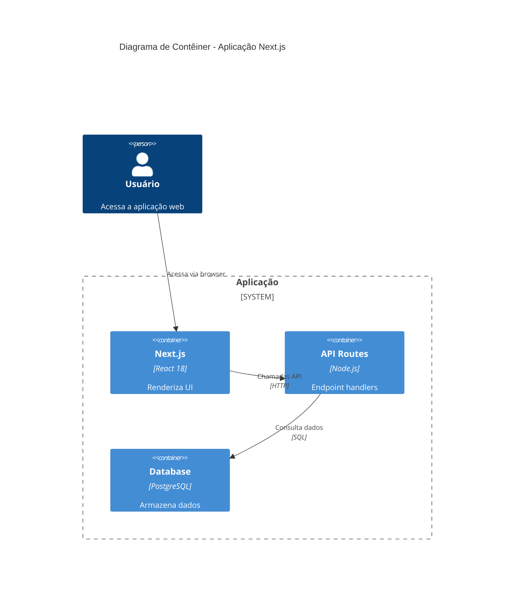

# System Patterns

```yaml
---
title: Padrões Arquiteturais
description: Documentação de padrões e convenções do sistema
updated: 2025-06-27
---
```

## Diagrama C4 - Visão de Contêiner



## Padrões Frontend

### Gerenciamento de Estado
- **Padrão**: Context API + useReducer
- **Uso**: Para estado global compartilhado
- **Exemplo**:
```javascript
// contexts/AuthContext.js
export const AuthContext = createContext();

export function AuthProvider({children}) {
  const [state, dispatch] = useReducer(authReducer, initialState);
  return (
    <AuthContext.Provider value={{state, dispatch}}>
      {children}
    </AuthContext.Provider>
  );
}
```

### Roteamento
- **Padrão**: App Router do Next.js
- **Convenções**:
  - Páginas em `app/(group)/page.tsx`
  - APIs em `app/api/route.ts`

## Related Links
- [Next.js Documentation](https://nextjs.org/docs)
- [ADR-001: Escolha do Framework](./decisionLog.md#adr-001)
- [Guia de Estilo Frontend](./style-guide.md)
